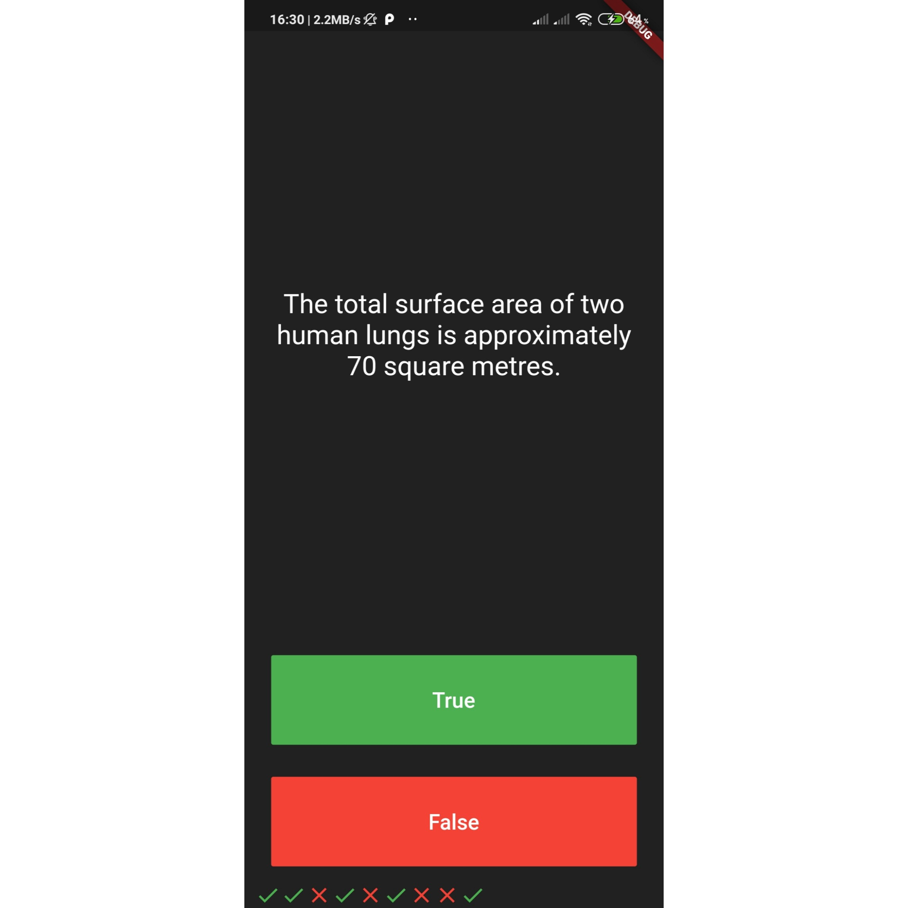
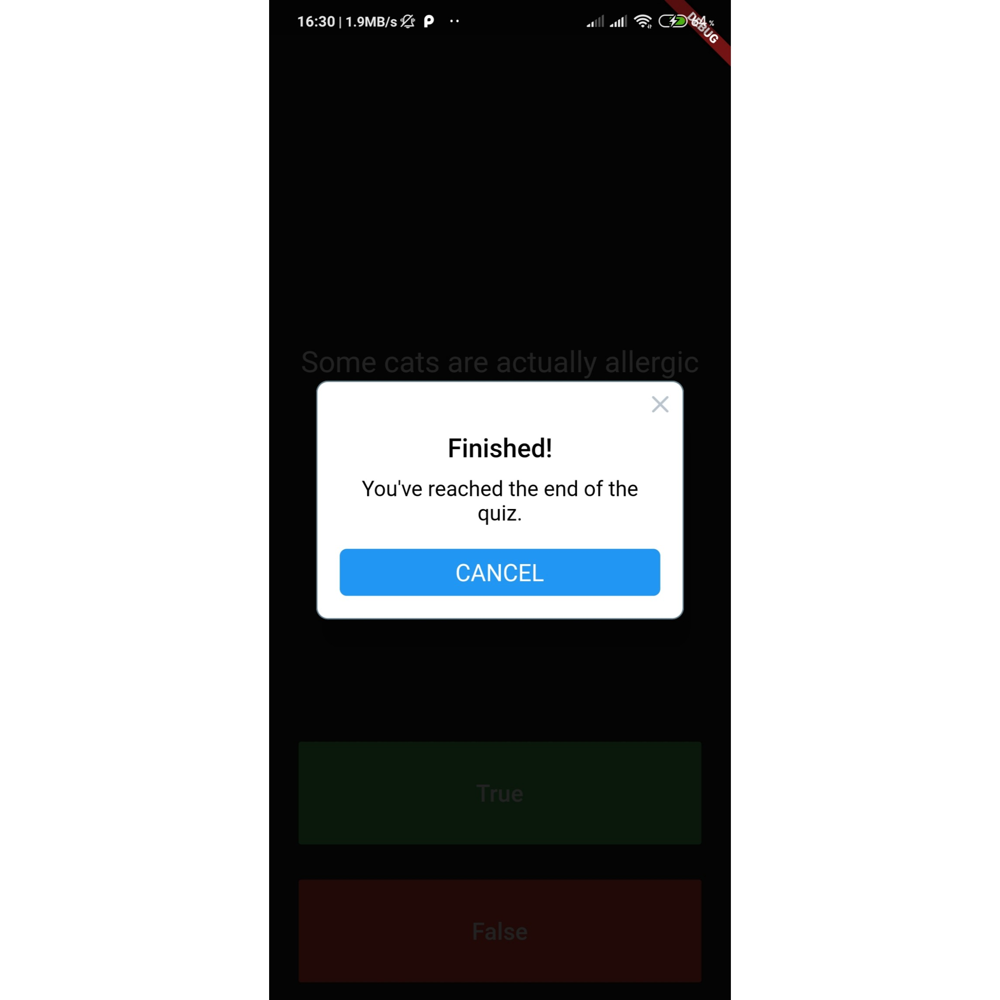

# Quizzler

A simple QUIZ application based on True or False type Questions.
It contains a number of general knowledge questions along with their respective true or false answers.
The answer will be displayed at bottom of the screen.
Once you solve all questions you will get a prompt to reset the Quiz.

Some of the key functionalities of this app includes:
-> OOP classes and objects.
-> Abstraction.
-> Encapsulation.
-> Inheritance.
-> Polymorphism.

A few resources to get you started if this is your first Flutter project:

- [Lab: Write your first Flutter app](https://flutter.dev/docs/get-started/codelab)
- [Cookbook: Useful Flutter samples](https://flutter.dev/docs/cookbook)

For help getting started with Flutter, view our
[online documentation](https://flutter.dev/docs), which offers tutorials,
samples, guidance on mobile development, and a full API reference.
